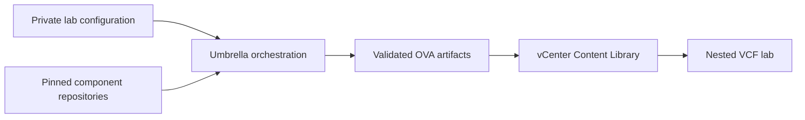

# Nested VCF Lab

Nested VCF Lab is an umbrella project for building, publishing, and eventually
deploying the virtual appliances required by a nested VMware Cloud Foundation
environment. It keeps upstream-derived builders in separate repositories while
providing one place for shared configuration, artifact handling, validation,
and operator documentation.

The project currently provides a complete umbrella workflow for the VyOS OVA.
VIS and nested ESXi are pinned as submodules and retain their own build flows
while their umbrella adapters are developed.

## Project goals

- Produce repeatable VyOS, VIS, and nested ESXi appliance artifacts.
- Keep private infrastructure values and credentials outside version control.
- Reuse common vCenter, Content Library, and artifact configuration.
- Preserve clean component boundaries so changes can be contributed upstream.
- Support private, routable VCF lab topologies on vSphere Supervisor and VM
  Operator.
- Record source revisions, dependency checksums, and generated artifact
  metadata.



## Component status

| Component | Responsibility | Umbrella status |
| --- | --- | --- |
| [VyOS OVA Builder](docs/components/vyos-ova-builder.md) | Builds and packages a VMware OVA with secure first-boot vApp configuration | End-to-end build and upload supported |
| [VyOS Build](docs/components/vyos-build.md) | Supplies the pinned VyOS image-build source | Integrated dependency |
| [VCF Infrastructure Services Appliance](docs/components/vis.md) | Provides DNS, NTP, DHCP, depot, backup, registry, identity, and KMS services | Component build only; umbrella adapter planned |
| [Nested ESXi Packer](docs/components/nested-esxi.md) | Builds a customizable nested ESXi appliance | Experimental; refactoring required |

## Quick start

```bash
git clone --recurse-submodules git@github.com:mtornblad/nested-vcf-lab.git
cd nested-vcf-lab

cp configuration/lab.example.json configuration/lab.local.json
chmod 600 configuration/lab.local.json
${EDITOR:-vi} configuration/lab.local.json

./orchestration/check-build-host.sh
./orchestration/run_vyos.py validate
./orchestration/run_vyos.py test
./orchestration/run_vyos.py build
```

To upload the completed OVA:

```bash
./orchestration/run_vyos.py validate-upload
./orchestration/run_vyos.py upload
```

The private configuration file and all binary artifacts are excluded from Git.

## Documentation

Start with the [documentation home](docs/index.md), then follow the path that
matches your task:

- [Architecture](docs/architecture.md)
- [Getting started](docs/getting-started.md)
- [Build host](docs/build-host.md)
- [Configuration](docs/configuration.md)
- [Build and publish workflows](docs/build-workflows.md)
- [Network architecture](docs/networking.md)
- [Deployment and first boot](docs/deployment.md)
- [Service placement](docs/service-placement.md)
- [Security model](docs/security.md)
- [Troubleshooting](docs/troubleshooting.md)
- [Development and contribution](docs/development.md)
- [Roadmap](docs/roadmap.md)

## Scope

This repository is intended for labs, proof-of-concept environments, and
controlled engineering workflows. It does not make the generated environment
production-ready by itself. Review security, availability, backup, licensing,
and vendor support requirements before applying any part of the design to a
production environment.
