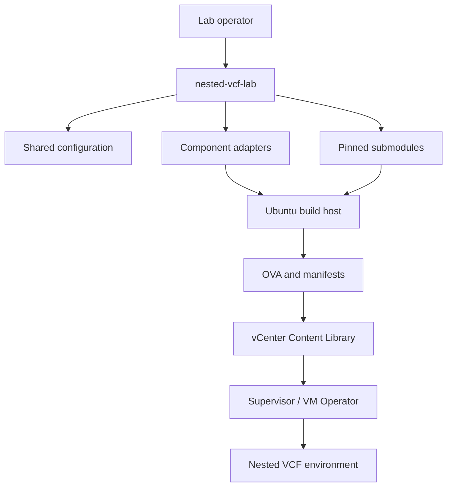
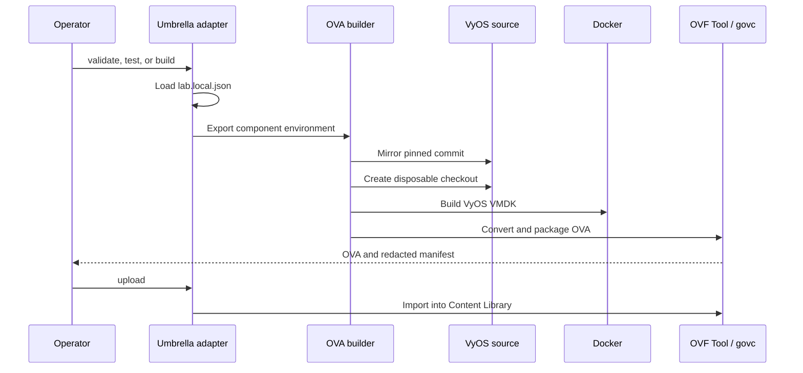

# Architecture

Nested VCF Lab separates shared policy from component implementation. The
umbrella repository does not copy component sources or patch a user-managed
checkout in place. It records exact submodule commits, translates shared
configuration into component-specific environment variables, and directs
generated output into an ignored artifact tree.

## System context

## Architectural layers

| Layer | Owned here | Responsibility |
| --- | --- | --- |
| Source control | `.gitmodules`, component gitlinks | Pin known component revisions without merging their histories |
| Shared configuration | `configuration/` | Hold common vCenter and component build settings; exclude private overrides |
| Orchestration | `orchestration/` | Validate the host and translate umbrella settings into component contracts |
| Components | `components/` | Build appliance-specific images and implement guest behavior |
| Artifact workspace | `artifacts/` | Cache dependencies and sources, hold disposable worktrees, and store outputs |
| Deployment | Content Library, CCI, VM Operator | Instantiate artifacts and deliver first-boot properties |
| Runtime services | VyOS and VIS | Provide routing and optional infrastructure services to the nested environment |

## Build-time data flow

The VyOS path is the reference implementation for future component adapters.

## Runtime responsibility

VyOS and VIS are complementary rather than interchangeable:

- VyOS is the network data plane. It terminates the namespace uplink and trunk,
  routes nested VLANs, and can provide NAT and bootstrap DNS/NTP when selected.
- VIS is a service control plane. It supplies optional DNS, NTP, DHCP, software
  depot, SFTP backup, registry, LDAP, OIDC, KMS, shared certificates, health,
  and update management.
- Nested ESXi appliances consume the routed networks and become the hosts on
  which the inner VCF instance is deployed.

See [Service placement](service-placement.md) before enabling overlapping DNS,
NTP, or DHCP implementations.

## Current implementation status

| Capability | Current state | Target state |
| --- | --- | --- |
| Shared vCenter configuration | Implemented | Used by every component adapter |
| VyOS validation, test, build, and upload | Implemented | Add automatic build logging and rolling-source preflight |
| VIS build | Run inside its submodule | Add umbrella validation, build, publish, and configuration translation |
| Nested ESXi build | Experimental submodule | Refactor, secure, test, and expose through an umbrella adapter |
| Supervisor deployment blueprint | Pinned Build Tools submodule with source validation and contract tests | Replace remaining placement and image literals with environment configuration |
| VIS-managed VyOS | Not implemented | Optional desired-state integration through the VyOS API |

## Design principles

1. **Configuration is layered.** Generic committed defaults are overridden by
   ignored local files and then by process environment variables.
2. **Secrets do not become defaults.** Passwords and API keys must not appear
   in examples, OVA defaults, build manifests, or logs.
3. **Builds use immutable inputs.** The parent commit pins submodule revisions;
   dependency BOMs pin external payloads by checksum where possible.
4. **Workspaces are disposable.** Component customization occurs below
   `artifacts/`, never in the source submodule used as input.
5. **Runtime interfaces are explicit.** OVF properties form a documented
   contract between image builders and deployment automation.
6. **Current and target behavior stay distinct.** Documentation and tests must
   not describe roadmap functionality as already delivered.

[Documentation home](index.md) · [Repository layout](repository-layout.md) ·
[Network architecture](networking.md)
