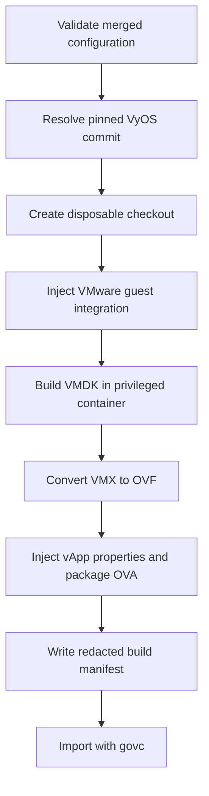

# Build and publish workflows

## Workflow support matrix

| Action | VyOS | VCF Automation | VIS | Nested ESXi |
| --- | :---: | :---: | :---: | :---: |
| Umbrella validation | Yes | Yes | No | No |
| Umbrella unit tests | Yes | Yes | No | No |
| Umbrella build/package | Yes | Yes | No | No |
| Umbrella publish/upload | Yes | Yes | No | No |
| Component-native build | Yes | Yes | Yes | Experimental |

There is no top-level `build-all` command today. The supported umbrella path
is implemented for VyOS and VCF Automation; VIS and nested ESXi retain their
component-native workflows until their adapters and common artifact contracts
are implemented.

## VyOS end-to-end workflow



Run from the umbrella root:

```bash
./orchestration/check-build-host.sh
./orchestration/run_vyos.py validate
./orchestration/run_vyos.py test
./orchestration/run_vyos.py build
./orchestration/run_vyos.py validate-upload
./orchestration/run_vyos.py upload
```

The builder does not alter `components/vyos-build`. It mirrors its exact `HEAD`
and creates a disposable checkout under `artifacts/vyos/work/`. Guest files and
the VMware build flavor are copied only into that workspace.

### Inputs

- Exact `components/vyos-build` gitlink revision.
- `components/vyos-ova-builder` implementation and defaults.
- Umbrella private configuration and explicit environment overrides.
- Checksum-pinned Syft package from the builder BOM.
- The rolling VyOS Debian package repository selected by `vyos-build`.

### Outputs

| File | Purpose |
| --- | --- |
| `artifacts/vyos/builds/vyos-vmware-vapp.ova` | Deployable appliance |
| `artifacts/vyos/builds/vyos-vmware-vapp.build.json` | Source, effective build configuration, size, and SHA-256 |
| `artifacts/vyos/logs/*.log` | Operator-captured build logs |

### Rolling-source synchronization

VyOS rolling source and the rolling package repository move together. A stale
source revision can request a kernel package that has already been replaced.
Update deliberately:

```bash
git -C components/vyos-build remote set-url upstream \
  https://github.com/vyos/vyos-build.git 2>/dev/null ||
git -C components/vyos-build remote add upstream \
  https://github.com/vyos/vyos-build.git

git -C components/vyos-build fetch upstream rolling
git -C components/vyos-build switch rolling
git -C components/vyos-build merge --ff-only upstream/rolling
git -C components/vyos-build push origin rolling

git add components/vyos-build
git diff --cached --submodule=log
git commit -m "chore: update VyOS build sources"
```

Do not edit `data/defaults.toml` merely to guess a kernel version. Kernel bumps
are coordinated across VyOS build and package repositories.

## VIS workflow

**Current:** VIS is built directly inside `components/vis` with Packer's
`vmware-iso` builder against a standalone ESX host. It exports an OVA under
`output-vmware-iso/` and creates checksums plus split release parts.

Read the component's own build documentation before running it:

- [VIS build guide](https://github.com/mtornblad/vcf-infrastructure-service-appliance/blob/main/docs/build.md)

Typical component commands are:

```bash
cd components/vis
packer validate -var-file=vis-builder.json -var-file=vis-version.json vis.json
./build.sh
```

The pinned revision still contains environment-specific values in tracked var
files. Do not reuse or publish them. The planned umbrella adapter must move
those values to ignored local configuration before this becomes the supported
top-level workflow.

## Nested ESXi workflow

**Current:** the component uses a Packer `vsphere-iso` builder, an ESXi
kickstart file, a guest customization hook, and a Python OVF/OVA postprocessor.
It has no umbrella runner and its pinned revision has unresolved consistency
and secret-management issues.

Treat it as source material for the planned refactor, not as a supported
release workflow. See [Nested ESXi](components/nested-esxi.md).

## VCF Automation blueprint workflow

**Current:** `components/vcf-automation` is an independently versioned Aria
Build Tools project. It does not build an appliance; it validates, packages,
and publishes the full CCI/Supervisor blueprint.

```bash
./orchestration/check-build-host.sh automation
./orchestration/run_automation.py show
./orchestration/run_automation.py pull
./orchestration/run_automation.py validate
./orchestration/run_automation.py test
./orchestration/run_automation.py build
./orchestration/run_automation.py upload
```

The runner defaults to `automation.maven_profile` from the private umbrella
configuration. `VCFA_PROFILE` and `--profile` provide environment and one-shot
overrides. The selected profile refers to a private Maven profile containing
the VCF Automation endpoint and authentication.

`pull` and its `download` alias export the objects selected by the component's
`content.yaml` and overwrite their local source files. The component Makefile
rejects a dirty Git checkout by default. Commit or stash local work before
pulling; use `--force` only when discarding local changes is intentional. Review
the resulting diff and run the tests before committing the synchronized source.

Source tests do not replace a render test on the target platform. After
publish, request a deployment with test inputs and validate the raw
`vcf_deployment_json` output:

```bash
./orchestration/run_automation.py validate-spec \
  --spec /path/to/vcf-deployment.json
```

The current disposable-lab inputs render plaintext credentials. Protect the
file with mode `0600`; `--allow-secret-references` is needed only as a
structural compatibility mode if encrypted inputs are introduced later.

See [VCF Automation Blueprint](components/vcf-automation.md) for its
configuration, image, and secret contracts.

## Build records

Every supported component workflow should eventually emit a redacted JSON
manifest containing:

- component and source commit;
- builder version;
- dependency versions and checksums;
- non-secret effective configuration;
- start and completion timestamps;
- artifact filename, size, and SHA-256;
- success or failure state and log path.

The VyOS manifest implements the core of this model. VIS and nested ESXi should
adopt the same schema principles when their adapters are added.

[Getting started](getting-started.md) · [Artifacts](../artifacts/README.md) ·
[Troubleshooting](troubleshooting.md)
