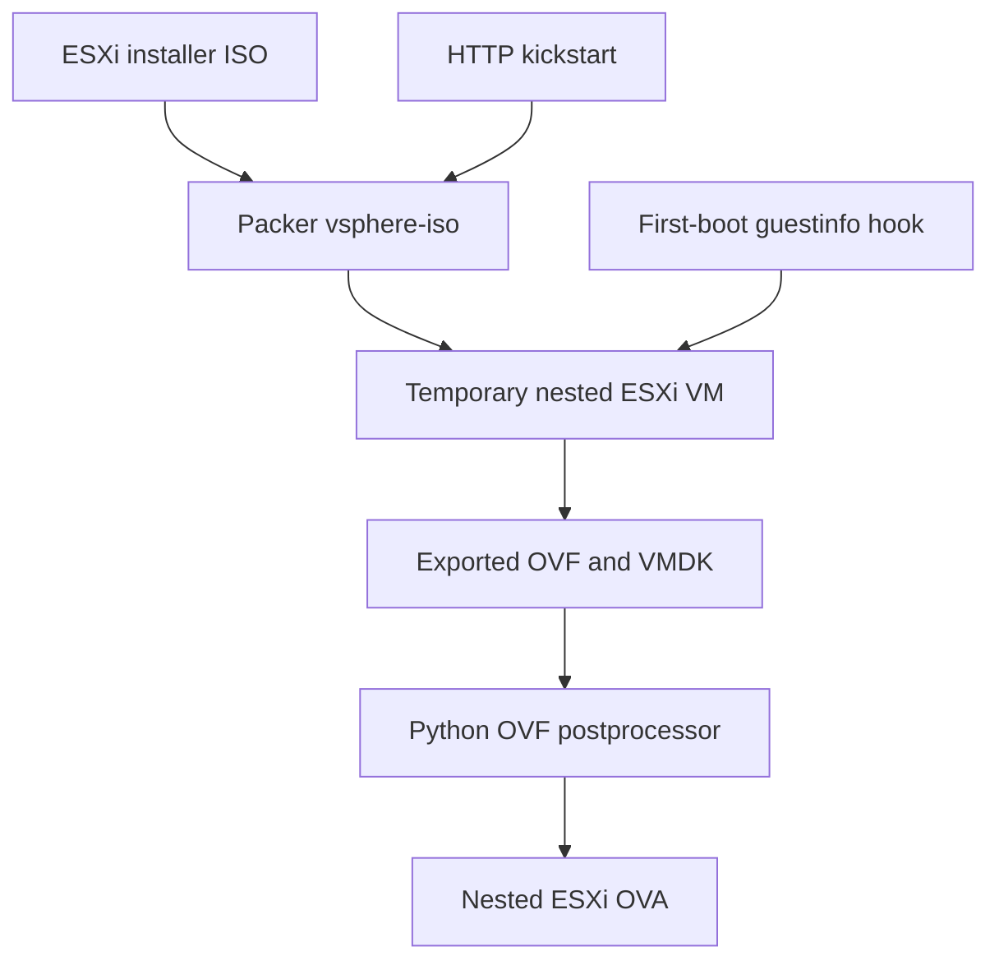

# Nested ESXi Packer

Repository: <https://github.com/mtornblad/nested-esxi-packer>

The component is intended to build a nested ESXi appliance from an installer
ISO, customize it from vApp properties, and package it as an OVA for repeatable
host deployment.

> **Status: experimental.** The pinned revision is useful source material but
> is not yet a supported umbrella build. Resolve the gaps below before using it
> to publish a reusable image.

## Choose an image source

The deployment blueprint needs a nested ESXi OVA that has already been
published as a VM Operator image. There are currently two acquisition paths:

| Path | Status | Recommended use |
| --- | --- | --- |
| Download a prebuilt Nested ESXi Virtual Appliance | Current | Default for end-to-end blueprint testing |
| Build with `nested-esxi-packer` | Experimental | Builder development only until the acceptance criteria below pass |

## Use a prebuilt appliance (current path)

William Lam maintains a [Nested Virtualization](https://williamlam.com/nested-virtualization)
index with links to both free and license-entitlement Nested ESXi Virtual
Appliances on the Broadcom Support Portal. Portal authentication and an
applicable entitlement may be required, depending on the release.

1. Select an appliance release compatible with the VCF version being deployed.
   Verify it against the target VCF bill of materials rather than selecting by
   recency alone.
2. Download it directly from the Broadcom Support Portal. Signed download URLs
   may expire; do not place them in committed configuration.
3. Store the original package outside Git, for example under
   `artifacts/esxi/downloads/`, and record its filename, version, source, and
   checksum in a reproducibility manifest.
4. Import the OVA into the Content Library consumed by the target Supervisor
   or VCF Automation project, then wait for image synchronization.
5. Verify the resulting VM Operator image and its vApp property contract.

```bash
kubectl get clustervirtualmachineimage

kubectl get clustervirtualmachineimage <image-name> \
  -o jsonpath='{range .status.ovfProperties[*]}{.key}{"\n"}{end}'
```

The current blueprint expects the nested ESXi appliance to expose these
properties:

```text
guestinfo.hostname
guestinfo.password
guestinfo.ipaddress
guestinfo.netmask
guestinfo.gateway
guestinfo.dns
guestinfo.domain
guestinfo.ntp
guestinfo.vlan
guestinfo.ssh
```

Finally, set `variables.esx_settings.vm_image` in the VCF Automation blueprint
to the synchronized image name and confirm that `variables.esx_settings.vm_class`
selects a class with nested hardware virtualization enabled. See
[VCF Automation Blueprint](vcf-automation.md).

Do not commit or redistribute downloaded ESXi binaries. Access, use, and
redistribution remain subject to the vendor's license and support terms.

## Build the appliance locally (experimental path)

The `nested-esxi-packer` submodule is our path toward a reproducible,
customizable appliance build. It is not yet fully functional or integrated
with umbrella orchestration, so it must not be assumed to produce the image
used by the current full-stack blueprint.

## Intended workflow



The template enables nested virtualization, creates two VMXNET3 adapters and a
thin boot disk, installs ESXi by kickstart, copies a first-boot script, exports
OVF, and attempts to add appliance properties and a manifest.

## Source layout

| Path | Intended purpose |
| --- | --- |
| `build.json` | Packer `vsphere-iso` template |
| `esx-builder.json` | vCenter, ISO, network, datastore, and HTTP settings |
| `http/ks.cfg` | Unattended ESXi installation |
| `files/local.sh` | Guestinfo-driven ESXi first-boot customization |
| `scripts/setup.sh` | Install the customization hook and back up ESXi state |
| `scripts/package_ova.py` | Add OVF metadata, write SHA-256 manifest, package OVA |

## Intended runtime property contract

The customization script attempts to consume the shared guestinfo convention:

- hostname
- password
- IP address and netmask
- gateway
- DNS servers and domain
- NTP servers
- management VLAN
- SSH enablement

The final refactor should publish these through a declarative property template
with empty secret defaults, VMware Tools transport, input validation, and tests.

## Gaps in the pinned revision

| Area | Current issue | Required outcome |
| --- | --- | --- |
| Secrets | Builder and kickstart files contain tracked environment values and credentials | Generic defaults plus ignored local configuration and environment overrides |
| File content | `files/local.sh` contains an apparent here-document wrapper rather than only the installed hook | Store and test the final ESXi hook directly |
| OVF contract | Postprocessor publishes only a subset of the properties consumed by the hook | One authoritative property template shared by packaging and tests |
| OVF transport | VMware Tools transport is not explicitly injected | Set and verify `com.vmware.guestInfo` |
| Artifact naming | Packer VM name and postprocessor OVF filename refer to different ESXi versions | Derive every filename from one versioned setting |
| TLS behavior | vCenter insecure mode is hard-coded | Configurable, secure default |
| Guest parsing | XML is parsed with `grep` and `awk` without a validation contract | Structured parsing with explicit failure messages |
| Build records | No redacted reproducibility manifest | Match the umbrella artifact policy |
| Testing | No automated tests are present | Add template, property, packaging, and secret-contract tests |
| Umbrella integration | `esxi` settings exist but no runner consumes them | Implement `run_esxi.py` after the component contract is stable |

## Refactor acceptance criteria

Before the component is marked supported:

1. No real infrastructure values or usable default passwords remain in the
   current tree or release artifacts.
2. Packer validation succeeds from an ignored local var file.
3. The build output name is derived from a single ESXi version setting.
4. Every published OVF property is consumed and every consumed property is
   published.
5. The guest receives `guestinfo.ovfEnv` through VMware Tools.
6. Static and DHCP first boot are both tested.
7. NIC roles are identified deterministically rather than by accidental order.
8. Generated OVA members and checksums are verified by tests.
9. The umbrella can validate, build, and publish without entering the
   submodule manually.

## Build caution

Do not run the checked-in var files unchanged. After the refactor, the expected
operator interface should resemble:

```bash
./orchestration/run_esxi.py validate
./orchestration/run_esxi.py test
./orchestration/run_esxi.py build
./orchestration/run_esxi.py upload
```

These commands are a **target interface** and do not exist in the current
revision.

[Component overview](index.md) · [Security](../security.md) ·
[Roadmap](../roadmap.md) · [Credits and further reading](../references.md)
