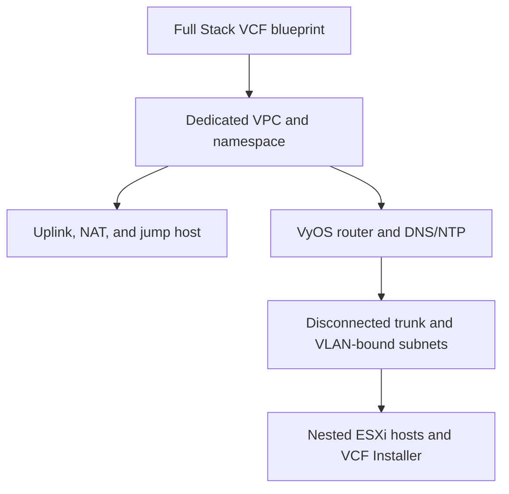

# VCF Automation Blueprint

Repository: <https://github.com/mtornblad/nested-vcf-automation>

This component is a VMware Aria Build Tools `vcfa-all-apps` project containing
the **Full Stack VCF** blueprint. The umbrella repository pins it as
`components/vcf-automation`; the component repository owns the blueprint,
tests, packaging, and publication contract.

> **Status: current but lab-specific.** Source validation and contract tests
> are implemented. Image IDs, region, zone, VM classes, storage policy, and
> several network ranges currently describe the reference lab and must be
> reviewed before use elsewhere.

## Provisioned topology



The blueprint creates the namespace networking, `SubnetConnectionBindingMap`
objects, bootstrap secrets, and VMs in one dependency graph. The ESXi VM
resource uses `length(variable.esx_settings.servers)`, so changing the server
list changes both provisioned host count and the generated VCF host list.

## Source layout

| Path | Purpose |
| --- | --- |
| `src/main/resources/blueprints/Full Stack VCF/content.yaml` | Blueprint source and deployment outputs |
| `src/main/resources/blueprints/Full Stack VCF/details.json` | Build Tools content metadata |
| `content.yaml` | Build Tools project descriptor |
| `scripts/validate_blueprint.py` | Duplicate-key, secret, networking, bootstrap, and template checks |
| `tests/test_blueprint_contract.py` | Regression tests for supported source contracts |
| `pom.xml` | Build Tools package and push lifecycle |

## Local validation and packaging

```bash
cd components/vcf-automation
python3 -m venv .venv
. .venv/bin/activate
python3 -m pip install -r requirements-dev.txt

make test
make package
```

Publishing requires a private Maven profile containing the VCF Automation
endpoint and authentication:

```bash
make push PROFILE=lab
```

Never add that profile or its credentials to this repository.

## Request inputs and variables

| Layer | Examples | Policy |
| --- | --- | --- |
| Request inputs | lab name, DNS prefix/domain, upstream DNS/NTP, optional Automation deployment | Safe defaults may be committed |
| Encrypted request inputs | shared lab password, VyOS REST key | No committed defaults |
| Structured variables | image IDs, VM classes, host list, IP pools, component settings | One source of truth; review per environment |
| Namespace Secret | bootstrap password and REST key | Created at deployment and referenced by VM Operator properties |

The shared password is convenient for a disposable lab, not a production
credential model. Use separate secret inputs before adapting this blueprint to
a longer-lived environment.

## Generated VCF deployment specification

The `vcf_deployment_json` output is intended for VCF Installer. It is generated
from the same ESXi server list, DNS/NTP settings, IP pools, and credentials used
by the blueprint.

The block-template renderer accepts one iterator variable. Keep loops in this
form:

```text
%{for host in variable.esx_settings.servers}
...
%{endfor}
```

Do not use Terraform-style `index, host` declarations. In the target renderer
that form has produced null object values and missing JSON delimiters.

After every platform-side render, validate the copied result before submitting
it to VCF Installer:

```bash
jq empty vcf-deployment.json
jq -r '.hostSpecs[].hostname' vcf-deployment.json
jq -r '.vcfAutomationSpec.ipPool[]?' vcf-deployment.json
```

The rendered file contains usable passwords. Store it with mode `0600`, never
commit it, and remove it when the deployment handoff is complete.

## Image contracts

The `vm_image` values identify `ClusterVirtualMachineImage` objects visible to
the target namespace. Before publishing the blueprint for another environment,
verify that every image exists and exposes the expected OVF properties:

```bash
kubectl get clustervirtualmachineimage
kubectl get clustervirtualmachineimage <image-name> \
  -o jsonpath='{range .status.ovfProperties[*]}{.key}{"\n"}{end}'
```

See [Nested ESXi Packer](nested-esxi.md) for image acquisition and the current
self-build status, and [Deployment](../deployment.md) for VM Operator and
guestinfo verification.

[Component overview](index.md) · [Architecture](../architecture.md) ·
[Security](../security.md)
