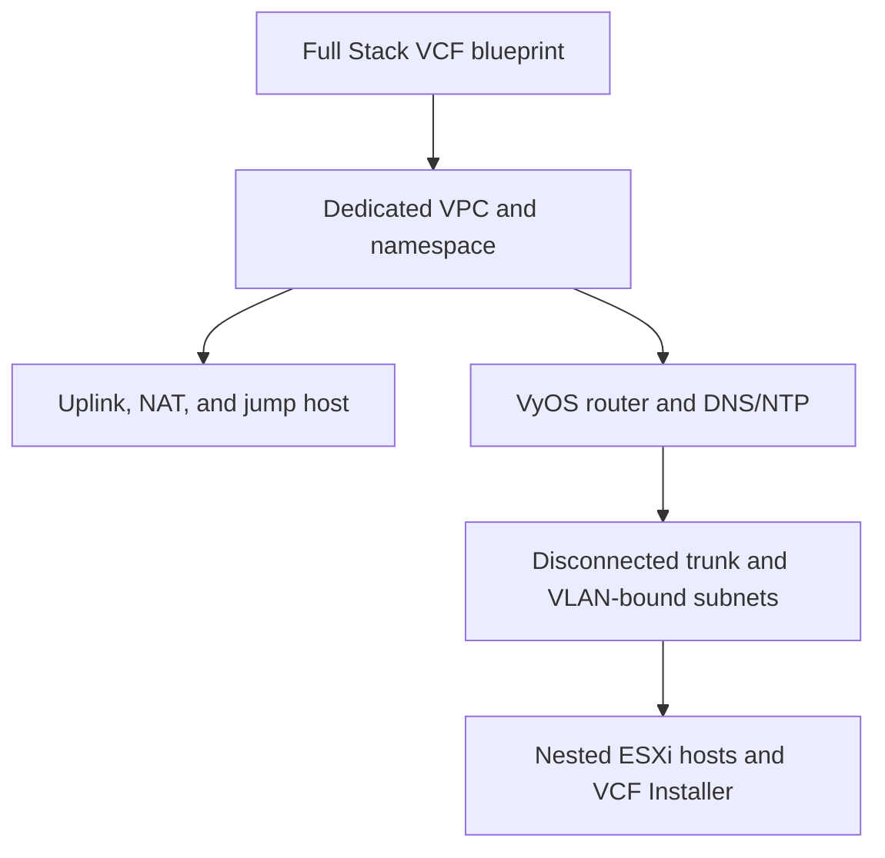

# VCF Automation Blueprint

Repository: <https://github.com/mtornblad/nested-vcf-automation>

This component is a VMware Aria Build Tools `vcfa-all-apps` project containing
the **Full Stack VCF** blueprint. The umbrella repository pins it as
`components/vcf-automation`; the component repository owns the blueprint,
tests, packaging, and publication contract.

> **Status: current but lab-specific.** Source validation and contract tests
> are implemented. Image IDs, region, zone, VM classes, storage policy, and
> several network ranges currently describe the reference lab and must be
> reviewed before use elsewhere.

## Provisioned topology



The blueprint creates the namespace networking, `SubnetConnectionBindingMap`
objects, bootstrap secrets, and VMs in one dependency graph. The ESXi VM
resource uses `length(variable.esx_settings.servers)`, so changing the server
list changes both provisioned host count and the generated VCF host list.
An optional raw-block PVC is created per host and attached on an NVMe
controller for nested vSAN capacity.

## Source layout

| Path | Purpose |
| --- | --- |
| `src/main/resources/blueprints/Full Stack VCF/content.yaml` | Blueprint source and deployment outputs |
| `src/main/resources/blueprints/Full Stack VCF/details.json` | Build Tools content metadata |
| `content.yaml` | Build Tools project descriptor |
| `scripts/validate_blueprint.py` | Duplicate-key, secret, networking, bootstrap, and template checks |
| `scripts/validate_vcf_spec.py` | Offline semantic validation of rendered VCF Installer JSON |
| `tests/test_blueprint_contract.py` | Regression tests for supported source contracts |
| `pom.xml` | Build Tools package and push lifecycle |

## Local validation and packaging

```bash
./orchestration/check-build-host.sh automation
./orchestration/run_automation.py pull
./orchestration/run_automation.py validate
./orchestration/run_automation.py test
./orchestration/run_automation.py build
```

Publishing requires a private Maven profile containing the VCF Automation
endpoint and authentication:

```bash
./orchestration/run_automation.py upload
./orchestration/run_automation.py upload --profile integration
```

Never add that profile or its credentials to this repository.

The default comes from `automation.maven_profile` in the private umbrella
configuration. `VCFA_PROFILE` overrides that setting and `--profile` has the
highest precedence.

`pull` exports the objects listed in `content.yaml` from the selected VCF
Automation profile. `download` is an alias for the same operation. Because the
Build Tools pull goal overwrites local source, both commands refuse to run with
uncommitted component changes unless `--force` is explicitly supplied. Always
inspect `git -C components/vcf-automation diff` and rerun the component tests
after a pull.

The tested VCF Installer image uses a mixed bootstrap contract. Only the
hostname is `vami.hostname`; its IP settings are the unqualified
`ip_address_version`, `ip0`, `netmask0`, `gateway`, `domain`, `searchpath`, and
`DNS` keys. Component validation enforces that exact set so a VCFA pull cannot
silently reintroduce non-working prefixes or `.SDDC-Manager` suffixes.

## Request inputs and variables

| Layer | Examples | Policy |
| --- | --- | --- |
| Request inputs | lab name, DNS prefix/domain, upstream DNS/NTP, fabric MTU, vSAN disk enable/size, optional Automation deployment | Safe defaults may be committed |
| Plaintext lab credentials | shared lab password, VyOS REST key | No committed defaults; visible in request and output |
| Structured variables | image IDs, VM classes, host list, IP pools, component settings | One source of truth; review per environment |
| Namespace Secret | bootstrap password and REST key | Created at deployment and referenced by VM Operator properties |

The shared password is convenient for a disposable lab, not a production
credential model. Use separate secret inputs before adapting this blueprint to
a longer-lived environment. Its request-time minimum is 15 characters because
VCF Services and VCF Automation impose the strictest minimum among the current
consumers.

`fabric_mtu` defaults to 9000 and drives the VyOS trunk and its VLAN
subinterfaces, the generated vMotion and vSAN networks, and the distributed
switch. Its accepted range is 1600 through 9000. The value must be supported by
the complete Supervisor-backed path, including NSX encapsulation headroom.
See [MTU](../networking.md#mtu) for the outer network checks.

## Nested ESXi storage and OVF properties

`esx_vsan_disk_enabled` defaults to `true`; `esx_vsan_disk_size_gib` defaults
to 100 GiB. The enabled path creates one `ReadWriteOnce`, raw-block PVC per
ESXi server, using the namespace storage policy, and attaches it as
`IndependentPersistent` on NVMe controller 0. Set the flag to `false` to
deploy the boot disk only. The two ESXi VM resources have mutually exclusive
counts, so exactly one variant is instantiated for every server entry.

`vsan_allow_hcl_incompatible_disks` defaults to `true` for this nested lab.
The request label is **Allow auto claim of HCL incompatible disks**. The value
is held in `vcf_settings.vsan.allow_hcl_incompatible_disks` and rendered as the
boolean `datastoreSpec.vsanSpec.esaConfig.skipHclAutoDiskClaim` in the VCF JSON.
It controls the ESA disk-claim path independently of whether the blueprint
attaches a capacity disk; other eligibility checks still apply.

Both variants use VM Operator `v1alpha5`. Verify that version and the NVMe
fields are present on the target Supervisor before publishing:

```bash
kubectl explain virtualmachine.spec.hardware.nvmeControllers \
  --api-version=vmoperator.vmware.com/v1alpha5
kubectl explain virtualmachine.spec.volumes.controllerType \
  --api-version=vmoperator.vmware.com/v1alpha5
```

The tested nested ESXi image contract is explicitly prefixed:
`guestinfo.hostname`, `guestinfo.password`, `guestinfo.ipaddress`,
`guestinfo.netmask`, `guestinfo.gateway`, `guestinfo.dns`, `guestinfo.domain`,
`guestinfo.ntp`, `guestinfo.vlan`, and `guestinfo.ssh`. These are the keys that
work in the current lab and must be preserved verbatim.

The blueprint also defines one canonical FQDN for VyOS and one for the VCF
Installer. VyOS ignores its local hosts file while serving the lab zone, which
prevents its Debian `127.0.1.1` entry from overriding the authoritative VyOS A
record. The same VyOS FQDN is used by ESXi, VCF Installer, and the generated
deployment JSON for NTP. The installer A/PTR records and `vami.hostname` use
`installer_settings.fqdn`. The new SDDC Manager has a separate identity in
`vcf_settings.sddc_manager`: `mtsddcm01.dclab.se` at `172.16.1.207` in the
reference lab, distinct from the installer at `172.16.1.10`.
`sddcManagerSpec.hostname` uses that SDDC Manager FQDN and keeps
`useExistingDeployment: false`.
See [Installer and SDDC Manager identities](../installer-identity.md) for
read-only checks that distinguish a deployment-target collision from a stale
installer hostname.

External A records belong in `vyos_settings.dns.additional_a_records` with
`zone`, `name`, and `address` fields. The reference entry resolves
`vis-appliance.dclab.se` to `10.114.10.9`. The forwarder ignores `/etc/hosts`, so
an entry in that file alone is insufficient for clients querying VyOS.

## Generated VCF deployment specification

The `vcf_deployment_json` output is intended for VCF Installer. It is generated
from the same ESXi server list, DNS/NTP settings, IP pools, and credentials used
by the blueprint.

The block-template renderer accepts one iterator variable. Keep loops in this
form:

```text
%{for host in variable.esx_settings.servers}
...
%{endfor}
```

Do not use Terraform-style `index, host` declarations. In the target renderer
that form has produced null object values and missing JSON delimiters.

After every platform-side render, save the raw value and validate it before
submitting it to VCF Installer:

```bash
./orchestration/run_automation.py validate-spec \
  --spec /path/to/vcf-deployment.json
```

The validator checks JSON syntax, host names, uniqueness, network membership,
IP ranges, numeric VLAN and MTU types, non-overlapping internal cluster CIDRs,
and required sections. The lab inputs are plaintext, so protect this rendered
file with mode `0600`, never commit it, and remove it when the handoff is
complete. `--allow-secret-references` remains available only as a structural
compatibility mode if encrypted inputs are introduced later; a value beginning
with `((secret:v1:...))` is not a usable VCF Installer password.

The reference variables assign `240.0.0.0/15` to the VCF Services runtime and
`198.18.0.0/15` to VCF Automation. Keep both configurable and distinct when
adapting the blueprint to another environment.

The final authority is the VCF Installer itself. Import the specification in
the UI or submit it to
[`POST /v1/sddcs/validations`](https://developer.broadcom.com/xapis/vcf-installer-api/latest/v1/sddcs/validations/post/);
the offline validator deliberately checks only deterministic structural and
network invariants.

## Image contracts

The `vm_image` values identify `ClusterVirtualMachineImage` objects visible to
the target namespace. Before publishing the blueprint for another environment,
verify that every image exists and exposes the expected OVF properties:

```bash
kubectl get clustervirtualmachineimage
kubectl get clustervirtualmachineimage <image-name> \
  -o jsonpath='{range .status.ovfProperties[*]}{.key}{"\n"}{end}'
```

See [Nested ESXi Packer](nested-esxi.md) for image acquisition and the current
self-build status, and [Deployment](../deployment.md) for VM Operator and
guestinfo verification.

[Component overview](index.md) · [Architecture](../architecture.md) ·
[Security](../security.md)
