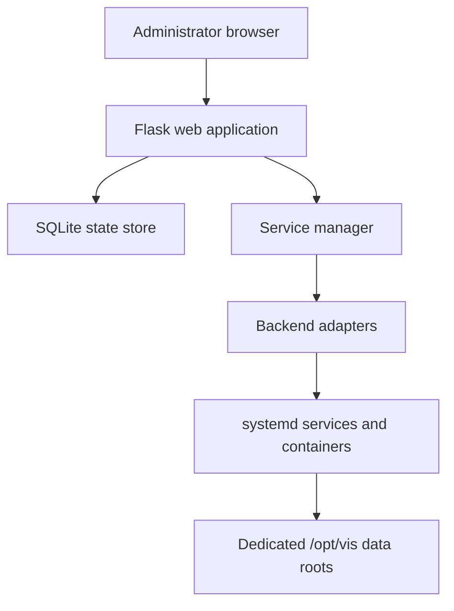

# VCF Infrastructure Services Appliance

Repository: <https://github.com/mtornblad/vcf-infrastructure-service-appliance>

VIS is an Ubuntu-based virtual appliance and web control plane for services
commonly required by VCF labs and proof-of-concept environments. It is useful
both alongside VyOS and in environments where routing and core network services
already exist.

## Service catalog

| Service | Backend | Default endpoint | Data root |
| --- | --- | --- | --- |
| Software Depot | VIS HTTP service | HTTP/8081 | `/opt/vis/data/depot` |
| SFTP Backup | OpenSSH SFTP | TCP/22 | `/opt/vis/data/sftp/backup` |
| Container Registry | Harbor | HTTP/9080 or shared TLS | `/opt/vis/data/registry` |
| LDAP Provider | OpenLDAP | LDAP/389 or LDAPS | `/opt/vis/data/identity/directory` |
| OIDC Provider | Keycloak | HTTP/9081 or shared TLS | `/opt/vis/data/identity/oidc` |
| DNS Server | Unbound | UDP/TCP 53 | `/opt/vis/data/dns` |
| NTP Server | Chrony | UDP/123 | `/opt/vis/data/time` |
| DHCP Server | dnsmasq | UDP/67 | `/opt/vis/data/dhcp` |
| Key Management Service | PyKMIP | TCP/5696 with TLS | `/opt/vis/data/kms` |

VIS also provides shared certificate management, configuration export/import,
system health and storage expansion, logs, and online or signed-offline update
workflows. Services are disabled by default and should be enabled only after
their settings validate.

## Internal architecture



Service definitions are seeded in `vis/definitions.py`, persistent state is
handled by `vis/store.py`, and runtime behavior is implemented through adapters
in `vis/manager.py`. UI routes do not directly mutate system services.

## Appliance storage

The pinned component build defines separate virtual disks for the operating
system and high-growth service data. Its documented defaults are 40 GB for the
OS, 200 GB for depot data, 15 GB for SFTP, 60 GB for registry data, and 2 GB
each for DNS and identity data. Size these for the selected services rather
than treating them as universal requirements.

## Build and deployment

**Current:** the submodule uses a Packer `vmware-iso` build against a standalone
ESX host. Ubuntu autoinstall creates the guest, provisioning scripts install the
application and services, and an OVF postprocessor adds deployment properties.

The component has detailed guides:

- [Architecture](https://github.com/mtornblad/vcf-infrastructure-service-appliance/blob/main/docs/architecture.md)
- [Build](https://github.com/mtornblad/vcf-infrastructure-service-appliance/blob/main/docs/build.md)
- [Deploy](https://github.com/mtornblad/vcf-infrastructure-service-appliance/blob/main/docs/deploy.md)
- [Services](https://github.com/mtornblad/vcf-infrastructure-service-appliance/blob/main/docs/services.md)
- [Usage](https://github.com/mtornblad/vcf-infrastructure-service-appliance/blob/main/docs/usage.md)
- [Development](https://github.com/mtornblad/vcf-infrastructure-service-appliance/blob/main/docs/develop.md)

The umbrella repository does not yet translate `lab.local.json` into VIS
Packer variables or publish VIS to Content Library.

## Test and documentation contract

Run focused tests followed by the component-prescribed suite:

```bash
cd components/vis
python3 -m unittest tests.test_services tests.test_packer_config
```

When VIS Markdown changes, regenerate its committed static documentation:

```bash
python3 docs/render_docs.py
```

## Current limitations

- Tracked Packer/BOM files in the pinned revision contain lab-specific values
  and default credentials. They must be moved to ignored local overlays and any
  exposed credentials rotated before general reuse.
- The current build targets a standalone ESX host rather than the common
  umbrella vCenter workflow.
- Availability is single-appliance unless external service redundancy is
  designed separately.
- Exported VIS configuration may contain credentials and must be protected as a
  secret-bearing backup.
- KMS, identity, certificate, depot, and backup services require a production
  security and availability assessment before use outside a lab.

## Intended umbrella integration

The future `run_vis.py` adapter should reuse general vCenter configuration,
support ignored component settings, validate required ISO and disk capacity,
emit a redacted build manifest, upload to Content Library, and preserve the
component's signed update model.

[Component overview](index.md) · [Service placement](../service-placement.md) ·
[Roadmap](../roadmap.md)
