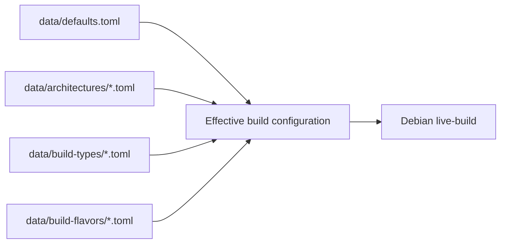

# VyOS Build

Fork: <https://github.com/mtornblad/vyos-build>

Upstream: <https://github.com/vyos/vyos-build>

`vyos-build` is the source dependency that assembles VyOS images from Debian
and VyOS-specific packages. The umbrella repository pins an exact fork commit;
the OVA builder consumes it without modifying the submodule.

## What it owns

- `build-vyos-image`, the primary Python entry point.
- TOML defaults, architecture profiles, build types, and image flavors.
- Debian `live-build` configuration and image hooks.
- The selected VyOS release train, package mirror, and kernel version.
- Package-build tooling and image smoketests.

The OVA builder adds its VMware-specific flavor and guest files only in a
disposable copy under `artifacts/vyos/work/`.

## Configuration composition

VyOS combines TOML fragments into one effective image configuration:



The OVA builder injects `vmware-vapp.toml`, which selects VMDK output, before
invoking `build-vyos-image vmware-vapp`.

## Rolling dependency behavior

The `rolling` Git branch and `https://packages.vyos.net/repositories/rolling`
are a coordinated moving set. The source records an exact `kernel_version`,
while the package repository may stop carrying an older rolling kernel after an
update.

A characteristic mismatch is:

```text
E: Unable to locate package linux-image-<version>-vyos
```

The correct response is to update the fork from upstream rolling, review the
changes, push the fork, and update the umbrella gitlink. Do not guess a new
kernel version in `data/defaults.toml`.

## Controlled update

```bash
git -C components/vyos-build status --short
git -C components/vyos-build remote -v

git -C components/vyos-build fetch upstream rolling
git -C components/vyos-build switch rolling
git -C components/vyos-build merge --ff-only upstream/rolling
git -C components/vyos-build push origin rolling

git add components/vyos-build
git diff --cached --submodule=log
git commit -m "chore: update VyOS build sources"
```

Add the official remote once if it is absent:

```bash
git -C components/vyos-build remote add upstream \
  https://github.com/vyos/vyos-build.git
```

The fast-forward requirement intentionally stops if the fork has diverged and
needs a reviewed merge or rebase.

## Version warnings

The OVA builder checks out the source commit in detached-HEAD state to preserve
the umbrella pin. Some `vyos-build` versions warn that they cannot derive a
branch-specific version string from a detached symbolic reference. That warning
is not itself an image-build failure; inspect the first preceding `E:` or failed
build stage.

## Contribution boundary

Changes intended for the official VyOS project follow upstream contribution
rules and commit conventions. VMware appliance integration specific to this lab
belongs in `vyos-ova-builder`, not in the forked build source unless it is a
generally useful upstream change.

[Component overview](index.md) · [VyOS OVA Builder](vyos-ova-builder.md) ·
[Troubleshooting](../troubleshooting.md)
