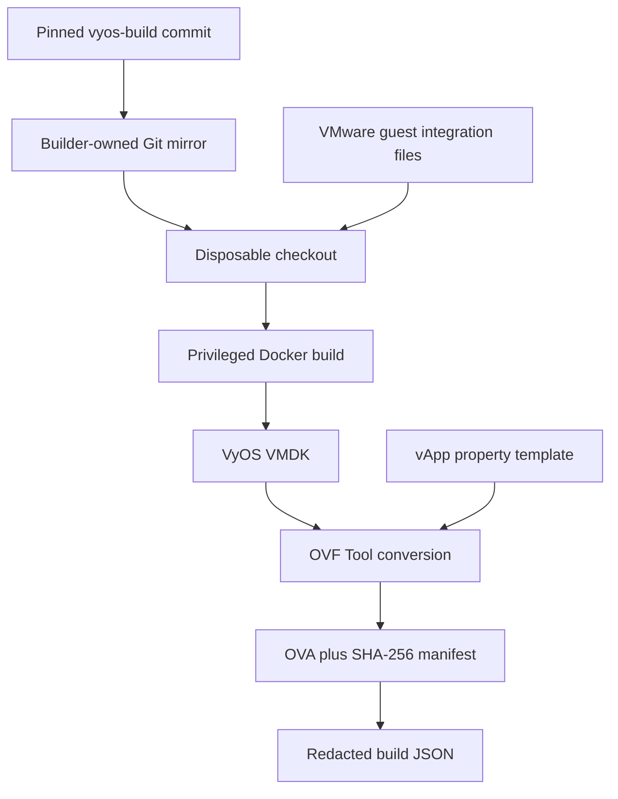
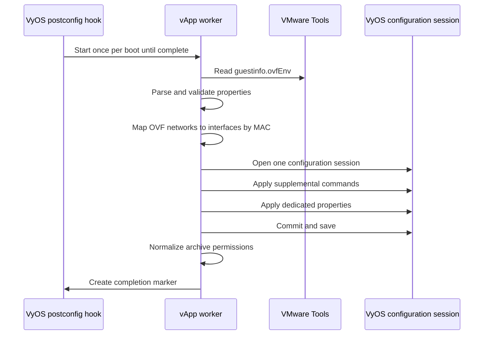

# VyOS OVA Builder

Repository: <https://github.com/mtornblad/vyos-ova-builder>

The VyOS OVA Builder turns a pinned VyOS source revision into a VMware OVA and
adds a safe, reusable first-boot configuration contract. It is the reference
component for umbrella integration.

## Responsibilities

- Resolve an exact local or remote `vyos-build` revision.
- Create a builder-owned mirror and disposable source checkout.
- Inject VMware guest tools and the first-boot worker into that checkout.
- Run the privileged VyOS image build in Docker.
- Convert the generated VMDK into OVF with VMware OVF Tool.
- Add vApp properties and `com.vmware.guestInfo` transport.
- Create the OVA manifest and a redacted JSON build record.
- Upload the result to a vCenter Content Library with `govc`.

It does not own Supervisor networking or the CCI blueprint, and it never resets
or patches the source submodule in place.

## Repository layout

| Path | Purpose |
| --- | --- |
| `config/defaults.json` | Generic build, appliance, upload, and path defaults |
| `config/local.json` | Optional ignored private overlay |
| `bom/` | Version and checksum for downloaded builder dependencies |
| `docker/` | Build container extension and ownership-restoring wrapper |
| `files/` | First-boot worker, parsers, interface resolver, and VyOS hook |
| `templates/` | VMware build flavor and vApp property definitions |
| `scripts/build.py` | Source preparation, container build, and artifact orchestration |
| `scripts/create_ova.py` | VMX rendering, OVF conversion, property injection, OVA packaging |
| `scripts/project_config.py` | Merge, validation, environment mapping, and redaction |
| `scripts/upload.py` | Content Library import |
| `tests/` | Build, security, parser, configuration, and interface contracts |

## Build pipeline



The container wrapper receives the invoking host UID and GID. The VyOS build
itself runs with the privilege it requires, then ownership is restored before
the container exits. An interrupted build is detected and repaired during the
next source preparation.

## Configuration

Component-local precedence is:

1. `config/defaults.json`
2. `config/local.json`, or `VYOS_OVA_CONFIG_FILE`
3. environment variables

The umbrella adapter supplies the third layer. See [Configuration](../configuration.md)
for the full mapping and vApp property table.

## First-boot sequence



The hook is `/config/scripts/vyos-postconfig-bootup.script`. No additional
systemd service or readiness wait is used. This avoids opening a nested
configuration session while VyOS itself is starting.

Supplemental input is parsed as arguments and never evaluated by a shell. Only
`set` and `delete` commands are accepted. Dedicated vApp properties are applied
after the supplemental payload and therefore take precedence.

## Operator commands

Through the umbrella:

```bash
./orchestration/run_vyos.py show
./orchestration/run_vyos.py validate
./orchestration/run_vyos.py test
./orchestration/run_vyos.py build
./orchestration/run_vyos.py validate-upload
./orchestration/run_vyos.py upload
```

Directly in the component:

```bash
make validate
make test
make dependencies
make build
make upload
```

## Test contract

The component test suite verifies:

- configuration precedence, validation, and secret redaction;
- safe source mirroring and disposable checkout behavior;
- ownership repair after privileged builds;
- checksum verification for downloaded dependencies;
- VMX hardware and adapter rendering;
- OVF transport and property injection;
- empty secret defaults;
- safe supplemental command parsing;
- MAC-based network-interface resolution;
- single-session VyOS commit/save behavior;
- postconfig hook installation and interactive archive permissions.

Run the repository-prescribed checks before committing component changes:

```bash
python3 -m unittest discover -s tests -v
python3 -m compileall -q scripts tests files/parse-config.py files/resolve_interface.py
bash -n build.sh upload.sh docker/run-build.sh files/vapp-init.sh \
  files/vyos-postconfig-bootup.script
```

## Constraints

- The pinned Syft package is currently amd64-specific.
- The source package repository is rolling and must stay synchronized with the
  pinned `vyos-build` revision.
- Docker must support privileged Linux containers.
- OVF Tool is proprietary and must be installed separately.
- Base64 supplemental configuration is not a secret transport.

[Component overview](index.md) · [Build workflows](../build-workflows.md) ·
[Deployment](../deployment.md)
