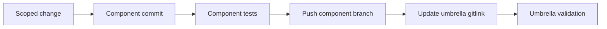

# Development and contribution

The umbrella repository coordinates independently versioned components. A
change must be committed in the repository that owns the behavior before the
parent gitlink is updated.

## Working model



## Initial setup

```bash
git clone --recurse-submodules git@github.com:mtornblad/nested-vcf-lab.git
cd nested-vcf-lab
git submodule status
```

Read a component's `AGENTS.md` and contribution documentation before changing
that component. Its rules take precedence within the submodule.

## Change a component

Example for the VyOS OVA Builder:

```bash
git -C components/vyos-ova-builder switch main
git -C components/vyos-ova-builder pull --ff-only origin main

# Edit and test inside the component.
make -C components/vyos-ova-builder test
git -C components/vyos-ova-builder diff --check

git -C components/vyos-ova-builder add <files>
git -C components/vyos-ova-builder commit -m "fix: describe the component change"
git -C components/vyos-ova-builder push origin main

git add components/vyos-ova-builder
git diff --cached --submodule=log
git commit -m "chore: update VyOS OVA builder submodule"
git push origin main
```

Never try to stage a file inside a submodule from the umbrella repository. Git
records only the component commit ID at the parent level.

## Update VyOS upstream source

The `vyos-build` fork tracks a fast-moving upstream rolling branch. Follow the
reviewed fast-forward procedure in [VyOS Build](components/vyos-build.md). If
the fork diverges, stop and review the commits rather than forcing the branch.

## Test matrix

| Scope | Command |
| --- | --- |
| Umbrella host/config | `./orchestration/check-build-host.sh` and `./orchestration/run_vyos.py validate` |
| Umbrella VyOS adapter | `./orchestration/run_vyos.py test` |
| VyOS OVA Builder | `make -C components/vyos-ova-builder test` |
| VIS focused suite | `python3 -m unittest tests.test_services tests.test_packer_config` from `components/vis` |
| VyOS shell syntax | Component `make test` target |
| Documentation links | `python3 orchestration/check-docs.py` |
| End-to-end VyOS | Build, upload, deploy, verify OVF transport and first boot |

The nested ESXi component has no automated suite in its pinned revision; adding
one is part of its refactor acceptance criteria.

## Commit conventions

- Use concise Conventional Commit-style messages for umbrella and locally
  owned component changes, for example `docs: add network architecture`.
- Preserve the upstream VyOS repository's own required commit format for
  changes intended for contribution there.
- Keep a gitlink update separate from unrelated umbrella changes when that
  improves reviewability.
- Do not commit generated OVA, OVF, VMDK, ISO, package, cache, or log files.

## Documentation conventions

- Write cross-component documentation in English under `docs/`.
- Use one topic per page and link related operator journeys in both directions.
- Use Mermaid for architecture and sequence diagrams so diagrams remain
  reviewable source.
- Label roadmap behavior as **Target** and implemented behavior as **Current**.
- Use generic names, RFC-safe examples, and non-secret placeholders.
- Update component-native documentation when behavior in that component
  changes; do not rely only on the umbrella summary.
- Run the local link checker before committing.

## Review checklist

```bash
git status --short
git diff --check
python3 orchestration/check-docs.py
./orchestration/run_vyos.py validate
./orchestration/run_vyos.py test
git diff --cached --submodule=log
```

For a documentation-only change, host dependencies may prevent the full build
test. Record which checks ran and why any environment-dependent check was not
run.

[Repository layout](repository-layout.md) · [Security](security.md) ·
[Roadmap](roadmap.md)
