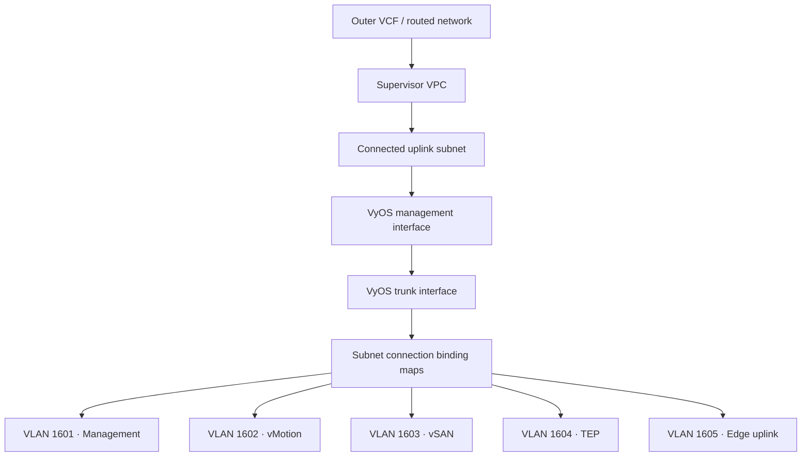

# Network architecture

This page describes a reference topology for a private nested VCF environment
deployed through vSphere Supervisor and VM Operator. Address ranges and VLAN IDs
are examples; keep environment-specific values in deployment configuration.

## Reference topology



VyOS connects the nested routed networks to the namespace uplink. Nested ESXi
VMs attach to the trunk and expose the tagged networks to their inner virtual
switching configuration.

## Example network plan

| Role | Example subnet | VLAN | Connectivity | Default gateway |
| --- | --- | ---: | --- | --- |
| Namespace uplink | `172.16.0.0/24` | Untagged | Connected | Supervisor-provided |
| Trunk transit | `172.16.100.0/24` | Untagged | Private | `172.16.100.1` |
| VCF management | `172.16.1.0/24` | 1601 | Private | `172.16.1.1` |
| vMotion | `172.16.2.0/24` | 1602 | Private | `172.16.2.1` |
| vSAN | `172.16.3.0/24` | 1603 | Private | `172.16.3.1` |
| ESXi and NSX TEP | `172.16.4.0/24` | 1604 | Private | `172.16.4.1` |
| NSX Edge uplink | `172.16.5.0/24` | 1605 | Private | `172.16.5.1` |

The table is a design example, not a default embedded in an appliance. Validate
all ranges against the outer VCF environment, Supervisor VPC blocks, Docker or
Kubernetes pod networks, and inner VCF internal CIDRs before deployment.

## Stable interface discovery

Do not assume that VMware adapter 0 becomes Linux `eth0`. VM Operator,
hypervisor presentation order, and guest enumeration can produce a different
mapping.

The VyOS OVA supports two explicit properties:

| Property | Expected value | Result |
| --- | --- | --- |
| `management_network` | OVF network name such as `uplink` | Resolve its adapter MAC to the Linux management interface |
| `trunk_network` | OVF network name such as `trunk` | Resolve its adapter MAC to the Linux trunk interface |

CCI may append a deployment-specific suffix to the Kubernetes Subnet name in
the OVF environment. The resolver accepts an exact match first and then the
expected `<name>_<suffix>` form.

Supplemental configuration should use the interface tokens rather than literal
device names:

```text
set interfaces ethernet __TRUNK_INTERFACE__ address 172.16.100.1/24
set interfaces ethernet __TRUNK_INTERFACE__ mtu 8000
set interfaces ethernet __TRUNK_INTERFACE__ vif 1601 address 172.16.1.1/24
set nat source rule 100 outbound-interface name __MANAGEMENT_INTERFACE__
set nat source rule 100 translation address masquerade
```

The first-boot worker replaces each standalone token after resolving the OVF
network to a MAC address and then to `/sys/class/net/<interface>/address`.

If `management_network` is empty, the worker retains an `eth0` fallback for
non-VM-Operator deployments. The trunk has no implicit fallback because
silently applying tagged configuration to the wrong interface is unsafe.

## Routing and NAT

A typical self-contained lab uses:

- a default route from VyOS through the namespace uplink gateway;
- directly connected routes for every VyOS VLAN interface;
- source NAT from private nested networks through the resolved management
  interface;
- explicit return routes on other machines when NAT is not desired.

Use routing, not source NAT, between inner private networks when end-to-end
source addresses are required. Use masquerade only for traffic leaving through
the outer namespace uplink.

## MTU

The usable MTU is limited by the smallest segment in the complete path:

```text
nested guest → inner vDS → nested ESXi vNIC → Supervisor subnet → NSX VPC → VyOS
```

Do not configure `9000` inside the nested environment merely because the inner
vDS accepts it. The Full Stack blueprint's `fabric_mtu` input defaults to 8000
and drives the VyOS trunk plus VLAN subinterfaces, the vMotion and vSAN
network specifications, and the distributed switch. Override it only with a
value supported by the complete path. The input accepts 1600 through 9000;
validate with non-fragmenting pings at progressively larger payload sizes from
both sides of every routed boundary.

## DNS and NTP

The infrastructure can use either VyOS, VIS, or existing external services for
DNS and NTP. Assign one authoritative owner for each zone and one primary time
source. Avoid serving the same zone independently from both appliances.

For the Full Stack blueprint, VyOS is authoritative for the lab forward and
reverse zones and forwards other queries upstream. It listens on its loopback
resolver and management address and ignores its local hosts file, preventing a
`127.0.1.1` host entry from overriding its authoritative A record. VyOS and VCF
Installer each have one canonical FQDN; the VyOS FQDN is also used consistently
as the NTP endpoint in VM bootstrap and the generated VCF specification.

These services must be available before VCF Installer begins validation. See
[Service placement](service-placement.md).

## Validation checklist

- The uplink and trunk names match the actual VM Operator `Subnet` names.
- VyOS logs show both networks mapped to different Linux interfaces.
- Every VLAN binding maps to the trunk with the intended tag.
- Default routes exist exactly where required.
- NAT applies only to the intended egress interface and source ranges.
- DNS forward and reverse records agree with the VCF deployment specification.
- NTP is reachable over UDP/123 from every nested management address.
- The end-to-end MTU has been measured, not inferred.

[Architecture](architecture.md) · [Deployment](deployment.md) ·
[Troubleshooting](troubleshooting.md)
