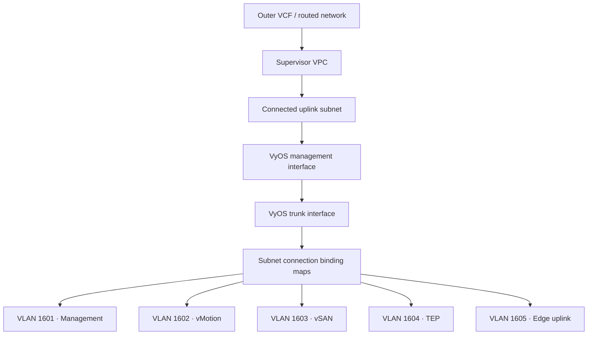

# Network architecture

This page describes a reference topology for a private nested VCF environment
deployed through vSphere Supervisor and VM Operator. Address ranges and VLAN IDs
are examples; keep environment-specific values in deployment configuration.

## Reference topology



VyOS connects the nested routed networks to the namespace uplink. Nested ESXi
VMs attach to the trunk and expose the tagged networks to their inner virtual
switching configuration.

## Example network plan

| Role | Example subnet | VLAN | Connectivity | Default gateway |
| --- | --- | ---: | --- | --- |
| Namespace uplink | `172.16.0.0/24` | Untagged | Connected | Supervisor-provided |
| Trunk transit | `172.16.100.0/24` | Untagged | Private | `172.16.100.1` |
| VCF management | `172.16.1.0/24` | 1601 | Private | `172.16.1.1` |
| vMotion | `172.16.2.0/24` | 1602 | Private | `172.16.2.1` |
| vSAN | `172.16.3.0/24` | 1603 | Private | `172.16.3.1` |
| ESXi and NSX TEP | `172.16.4.0/24` | 1604 | Private | `172.16.4.1` |
| NSX Edge uplink | `172.16.5.0/24` | 1605 | Private | `172.16.5.1` |

The table is a design example, not a default embedded in an appliance. Validate
all ranges against the outer VCF environment, Supervisor VPC blocks, Docker or
Kubernetes pod networks, and inner VCF internal CIDRs before deployment.

## Stable interface discovery

Do not assume that VMware adapter 0 becomes Linux `eth0`. VM Operator,
hypervisor presentation order, and guest enumeration can produce a different
mapping.

The VyOS OVA supports two explicit properties:

| Property | Expected value | Result |
| --- | --- | --- |
| `management_network` | OVF network name such as `uplink` | Resolve its adapter MAC to the Linux management interface |
| `trunk_network` | OVF network name such as `trunk` | Resolve its adapter MAC to the Linux trunk interface |

CCI may append a deployment-specific suffix to the Kubernetes Subnet name in
the OVF environment. The resolver accepts an exact match first and then the
expected `<name>_<suffix>` form.

Supplemental configuration should use the interface tokens rather than literal
device names:

```text
set interfaces ethernet __TRUNK_INTERFACE__ address 172.16.100.1/24
set interfaces ethernet __TRUNK_INTERFACE__ mtu 9000
set interfaces ethernet __TRUNK_INTERFACE__ vif 1601 address 172.16.1.1/24
set nat source rule 100 outbound-interface name __MANAGEMENT_INTERFACE__
set nat source rule 100 translation address masquerade
```

The first-boot worker replaces each standalone token after resolving the OVF
network to a MAC address and then to `/sys/class/net/<interface>/address`.

If `management_network` is empty, the worker retains an `eth0` fallback for
non-VM-Operator deployments. The trunk has no implicit fallback because
silently applying tagged configuration to the wrong interface is unsafe.

## Routing and NAT

A typical self-contained lab uses:

- a default route from VyOS through the namespace uplink gateway;
- directly connected routes for every VyOS VLAN interface;
- source NAT from private nested networks through the resolved management
  interface;
- explicit return routes on other machines when NAT is not desired.

Use routing, not source NAT, between inner private networks when end-to-end
source addresses are required. Use masquerade only for traffic leaving through
the outer namespace uplink.

## MTU

The usable MTU is limited by the smallest segment in the complete path. That
path includes the inner virtual switch, the nested ESXi VM's network adapter,
and the outer Supervisor/NSX network. Routed traffic also crosses VyOS;
host-to-host traffic within the same nested VLAN normally does not.

The Full Stack blueprint's `fabric_mtu` input defaults to **9000**. It drives
the VyOS trunk and VLAN subinterfaces, vMotion and vSAN network specifications,
and the nested distributed switch. It does not configure the underlying VCF
environment. Keep the distinction between an inner IP packet and the larger
packet carrying it through NSX:

| Layer | Setting or requirement |
| --- | --- |
| Nested vMotion/vSAN VMkernel interfaces | 9000 IP MTU by default |
| VyOS trunk and tagged interfaces | 9000 IP MTU by default |
| Nested vDS | At least the MTU of attached VMkernel interfaces; blueprint default 9000 |
| Outer vDS, NSX host/Edge transport, and uplinks | Must carry the nested packets plus the outer encapsulation |
| Physical switch ports, port channels, and routed transport links | Must carry the complete encapsulated frame on every hop |

A supported vDS can be configured up to 9190 bytes. Some physical switches use
9216 as their jumbo setting, but check whether that setting counts IP bytes or
the complete Ethernet frame. A 9000-byte IP MTU and a 9000-byte maximum frame
size are different limits. Raising only the physical switch does not overcome
a lower limit on an NSX/TEP/Edge path. Conversely, a switch does not need extra
IP MTU merely because it carries plain 802.1Q-tagged traffic; the extra
headroom here is for encapsulation. See
[Broadcom's jumbo-frame guidance](https://knowledge.broadcom.com/external/article/324494/).

For nested NSX workloads there can be both inner and outer tunnel headers.
Budget each encapsulation layer against the actual path and product limits.
Do not assume that a single 9190 setting proves a 9000-byte workload packet
will pass every nested overlay and Edge path.

### Locate the MTU bottleneck

Traffic between nested ESXi hosts in the same vMotion, vSAN, or TEP subnet
normally stays on that VLAN. It does not traverse the VyOS gateway, so changing
only VyOS cannot repair those host-to-host validation failures.

1. On the nested ESXi host, identify the VMkernel interface, its TCP/IP stack,
   and both standard/distributed switch settings:

   ```bash
   esxcli network ip interface list
   esxcli network ip interface ipv4 get
   esxcli network vswitch standard list
   esxcli network vswitch dvs vmware list
   ```

2. Test the actual peer VMkernel address with DF set. Replace `vmkX` and the
   address with the values from the first step. For IPv4, 8972 ICMP payload
   bytes plus 28 bytes of IP/ICMP headers tests a 9000-byte IP packet:

   ```bash
   vmkping -I vmkX -d -s 1472 -c 3 172.16.2.3
   vmkping -I vmkX -d -s 8972 -c 3 172.16.2.3
   ```

   If that interface uses the dedicated vMotion stack, add `++netstack=vmotion`
   to each `vmkping` command. Use the reported stack for other VMkernel types.
   Do not test a 9000-byte ICMP payload: that sends a larger IP packet.

3. Repeat with nested ESXi VMs on the same physical host and then on different
   physical hosts, using the same VLAN and peer configuration. If the same-host
   test passes and the cross-host test fails, focus on the outer transport
   nodes, uplinks, and physical path. If both fail, examine the inner VMkernel,
   nested vSwitch/vDS, outer virtual switch ports, and Supervisor subnet path.
   Placement is a diagnostic clue, not proof of one failing device.

4. On the physical ESXi hosts that run these VMs, check `esxcli network ip
   interface list` and `esxcli network vswitch dvs vmware list`. Identify the
   outer TEP interfaces and their stack names. Test TEP-to-TEP connectivity
   with DF and an appropriate payload for the configured transport MTU. A
   TEP-to-TEP 9000-byte ping alone does not prove that a 9000-byte guest packet
   plus GENEVE headers fits. Include Edge transport and routing where the
   failing path uses them.

5. In the outer NSX Manager, inspect **System > Fabric > Settings > Global
   Fabric Settings** and **MTU Configuration Check**, including every relevant
   host and Edge transport node. A read-only API inspection is:

   ```text
   GET /api/v1/global-configs/SwitchingGlobalConfig
   ```

   Compare the realized TEP/physical-uplink MTUs and uplink profiles, not only
   the global default. See
   [NSX MTU consistency checks](https://knowledge.broadcom.com/external/article/330488/).

6. Inspect the namespace's subnet resources and the effective NSX network
   configuration, including any DHCP-advertised MTU. From the Supervisor
   context:

   ```bash
   kubectl -n <namespace> get subnets -o yaml
   kubectl -n <namespace> get subnetconnectionbindingmaps -o yaml
   ```

   Check the corresponding physical switch ports and every inter-switch or
   routed link for jumbo limits, oversized-packet drops, and errors. Only after
   measuring the bottleneck decide which outer setting needs to change. A vDS
   MTU change can briefly interrupt its uplinks.

## DNS and NTP

The infrastructure can use either VyOS, VIS, or existing external services for
DNS and NTP. Assign one authoritative owner for each zone and one primary time
source. Avoid serving the same zone independently from both appliances.

For the Full Stack blueprint, VyOS is authoritative for the lab forward and
reverse zones and forwards other queries upstream. It listens on its loopback
resolver and management address and ignores its local hosts file, preventing a
`127.0.1.1` host entry from overriding its authoritative A record. VyOS and VCF
Installer each have one canonical FQDN; the VyOS FQDN is also used consistently
as the NTP endpoint in VM bootstrap and the generated VCF specification.

These services must be available before VCF Installer begins validation. See
[Service placement](service-placement.md).

The external VIS record is generated from
`vyos_settings.dns.additional_a_records` and resolves
`vis-appliance.dclab.se` to `10.114.10.9`. It must be in the served DNS zone;
adding it only to VyOS `/etc/hosts` has no effect when `ignore-hosts-file` is
enabled.

## Validation checklist

- The uplink and trunk names match the actual VM Operator `Subnet` names.
- VyOS logs show both networks mapped to different Linux interfaces.
- Every VLAN binding maps to the trunk with the intended tag.
- Default routes exist exactly where required.
- NAT applies only to the intended egress interface and source ranges.
- DNS forward and reverse records agree with the VCF deployment specification.
- NTP is reachable over UDP/123 from every nested management address.
- The end-to-end MTU has been measured, not inferred.

[Architecture](architecture.md) · [Deployment](deployment.md) ·
[Troubleshooting](troubleshooting.md)
