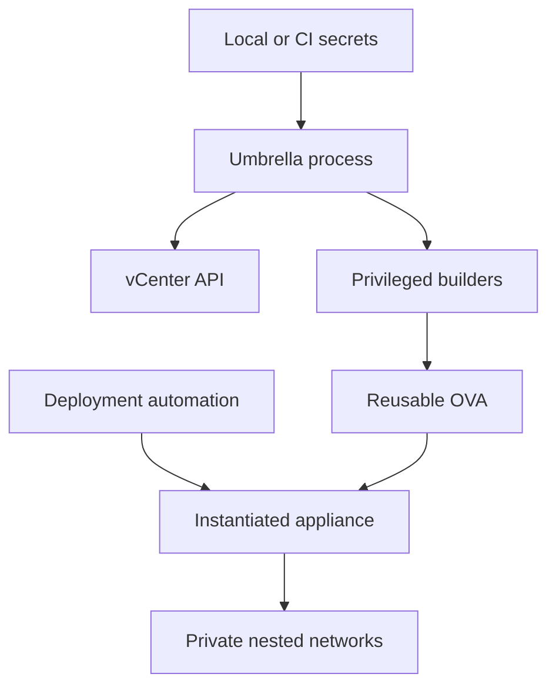

# Security model

The project builds privileged infrastructure appliances and can handle vCenter,
guest, API, and service credentials. Lab scope reduces availability
requirements; it does not remove the need for credential hygiene and controlled
build provenance.

## Trust boundaries

Build credentials belong to the orchestrator. Runtime credentials belong to
deployment automation. A reusable OVA must not contain either as a non-empty
default.

## Secret storage

Preferred order:

1. A CI or automation secret store that injects process environment variables.
2. `configuration/lab.local.json` with mode `0600` on a controlled host.
3. An interactive prompt exported only for the current shell session.

Never commit:

- vCenter, ESXi, VIS, VyOS, VCF, LDAP, OIDC, KMS, or registry passwords;
- REST API keys, activation codes, private signing keys, or SSH private keys;
- authenticated or expiring download URLs;
- deployment blueprints containing usable credentials;
- exported VIS profiles unless encrypted and managed outside Git.

## Current controls

The VyOS workflow provides:

- empty defaults for password and API-key OVF properties;
- recursive redaction in effective-configuration output and build manifests;
- no upload configuration in the reproducibility manifest;
- no shell evaluation of supplemental first-boot commands;
- an allow-list of `set` and `delete` commands;
- deterministic interface discovery by OVF network and MAC;
- one VyOS configuration session with explicit commit and save;
- checksum-pinned external builder dependency;
- isolated disposable customization and restored host ownership.

## Known security debt

| Component | Debt in pinned revision | Priority |
| --- | --- | --- |
| VIS | Tracked builder/version/BOM files contain lab-specific values and default credentials | Remove from current tree, rotate exposed credentials, introduce ignored overlays |
| Nested ESXi | Tracked builder and kickstart inputs contain infrastructure values and credentials | Refactor before another reusable release |
| Umbrella blueprints | Deployment examples may carry many product passwords if copied directly | Model them as secret inputs and keep private instances outside Git |
| TLS | Lab workflows may use insecure vCenter certificate verification | Install the CA or constrain insecure mode to temporary lab use |

Removing a value from the latest commit does not remove it from Git history.
Rotate any credential that has ever been committed. Decide separately whether
history rewriting is justified, because it changes every affected commit and
requires coordination with all clones.

## Privileged build execution

The VyOS image build runs a privileged Docker container. Anyone able to control
the image, mounted source, wrapper, or Docker daemon effectively controls the
build host. Use a dedicated builder, review image updates, restrict Docker
access, and avoid mixing unrelated sensitive workloads on the host.

## Artifact handling

Treat these as sensitive even when ignored by Git:

- local configuration files;
- complete build logs;
- instantiated or exported VMs containing deployment credentials;
- VIS configuration exports;
- OVA files built from unreviewed or private payloads;
- cached proprietary software and VCF binaries.

The generic VyOS OVA should contain no secret default. Once instantiated with
vApp secrets, the VM and any subsequent export inherit those secrets.

## Network exposure

- SSH and the VyOS REST API use VyOS default listen behavior when enabled.
  Restrict them through supplemental configuration and upstream policy where
  required.
- Do not expose VIS management, LDAP, OIDC, registry, KMS, depot, or backup
  endpoints directly to untrusted networks.
- Use one explicit egress NAT boundary and minimize inbound NAT rules.
- Prefer certificate trust over `insecure` flags.
- Use least-privilege service accounts for Content Library upload and future
  VIS-to-VyOS API access.

## Review checklist

- `git status --short` contains no local configuration or generated payload.
- Secret defaults are empty in every OVF property template.
- `show` and manifests redact sensitive fields.
- Build logs are reviewed before sharing.
- Source commits and dependency checksums are recorded.
- vCenter TLS policy is deliberate.
- REST, SSH, registry, identity, KMS, and backup exposure is documented.
- Any previously committed credentials have been rotated.

[Configuration](configuration.md) · [Service placement](service-placement.md) ·
[Development](development.md)
